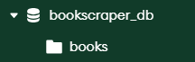

# BookScraper


## 📚 Overview

`BookScraper` is a powerful and robust web scraping tool designed to extract detailed information about books from
various online retailers and publishing platforms. Built with `asyncio` and `Playwright`, it efficiently navigates web
pages, collects data, and provides flexible output options to CSV files or a MongoDB database.

The project emphasizes reliability with features like dynamic user-agent rotation, retry mechanisms, and pre-flight
checks for output destinations, ensuring a smooth and resilient scraping experience.

---

## 🚀 Quick Start During Development

To quickly start the application at this stage of development:

1. Clone the repository
    ```bash
   git clone https://github.com/YannickLalonde/BookScraper.git
   cd BookScraper
    ```

2. Activate virtual environment and install requirements (MacOS)
    ```bash
    python3 -m venv .venv
   ```
   or
    ```bash
    python -m venv .venv
    ```
   then
    ```bash
    source ./.venv/bin/activate
    pip install -r requirements.txt
    playwright install chromium
    ```

3. Ensure the BookScraper/.env file is set with:

   ```dotenv
    MONGODB_URI="mongodb+srv://<username>:<password>@<cluster-url>/<database-name>?retryWrites=true&w=majority"
    TLS_CERT_FILE="/path/to/your/tls_certificate.pem" # Optional if not using client certificates
   ```
4. Change the search queries in src/bookscraper/parameters.py:
   ```python
   SEARCH_QUERIES = [
     "C++",
     "C++ Programming",
     # ...
   ]
   ```
5. Run the latest version of the BookScraper
    ```bash
    python3 -m src.bookscraper.search_and_scrape -m
    ```
5. The results will be saved in your MongoDB Atlas, database "bookscraper_db", collection "books":
   

---

## ✨ Features

* **Multi-Site Scraping:** Currently supports scraping book details from:
    * Amazon (`amazon.com`)
    * Packtpub (`packtpub.com`)
    * Leanpub (`leanpub.com`)
    * O'Reilly (`oreilly.com`)
* **Asynchronous & Parallel Processing:** Leverages `asyncio` and `Playwright` for high-performance concurrent scraping.
* **Robustness:**
    * **Retry Mechanism:** Automatic retries for failed page loads or scraping errors.
    * **User-Agent Rotation:** Randomly selects user-agents to mimic natural Browse patterns and avoid detection.
    * **Resource Blocking:** Blocks unnecessary resources (images, media, ads) for faster and more efficient scraping.
    * **404 Page Detection:** Identifies and skips URLs leading to 404 (Not Found) pages.
* **Flexible Output:**
    * **CSV Files:** Export scraped book data, failed URLs, and unhandled URLs to `.csv` files.
    * **MongoDB Atlas:** Store scraped data directly into a MongoDB database, with unique indexing to prevent duplicate
      entries.
* **Pre-flight Checks:** Verifies write permissions for CSV output and establishes MongoDB connection *before* starting
  the scraping process, preventing late-stage failures.
* **Comprehensive Logging:** Detailed console output for real-time progress and a dedicated log file (`bookscraper.log`)
  for in-depth debugging and historical records.
* **Command-Line Interface (CLI):** Easy-to-use arguments for specifying input file and output preferences.

---

## 🚀 Getting Started

These instructions will get you a copy of the project up and running on your local machine for development and testing
purposes.

### Prerequisites

* **Python 3.9+**: Make sure you have a compatible Python version installed. You can download it
  from [python.org](https://www.python.org/downloads/).
* **pip**: Python's package installer, usually comes with Python.
* **Playwright Browsers**: Playwright requires browser binaries. After installing project dependencies, you'll need to
  install them:
    ```bash
    # (after pip install -r requirements.txt)
    playwright install chromium
    ```
* **MongoDB Atlas Cluster (Optional, for MongoDB output)**: If you plan to use MongoDB output, you'll need access to a
  MongoDB Atlas cluster. Refer to the [MongoDB Atlas documentation](https://www.mongodb.com/cloud/atlas/getting-started)
  for setup instructions. You'll need a `MONGODB_URI` and potentially a `TLS_CERT_FILE`.

### Installation

1. **Clone the repository:**
   ```bash
   git clone https://github.com/YannickLalonde/BookScraper.git
   cd BookScraper
   ```
2. **Create and activate a Python virtual environment (recommended):**
   ```bash
   python -m venv .venv
   # On Windows:
   .venv\Scripts\activate
   # On macOS/Linux:
   source .venv/bin/activate
   ```
3. **Install project dependencies using pip:**
   ```bash
   pip install -r requirements.txt
   ```
   You'll need a `requirements.txt` file in your project root with the following content:
   ```
   playwright>=1.43.0
   pandas>=2.0.0
   python-dotenv>=1.0.0
   pymongo>=4.0.0
   ```
4. **Install Playwright browser binaries:**
   ```bash
   playwright install chromium
   ```

### Configuration (`.env` file)

For MongoDB output, you need to set up environment variables. Create a file named `.env` in the root directory of the
project (the same directory as `pyproject.toml` and `README.md`).

```dotenv
MONGODB_URI="mongodb+srv://<username>:<password>@<cluster-url>/<database-name>?retryWrites=true&w=majority"
TLS_CERT_FILE="/path/to/your/tls_certificate.pem" # Optional if not using client certificates
````

* Replace `<username>`, `<password>`, `<cluster-url>`, and `<database-name>` with your MongoDB Atlas credentials.
* `TLS_CERT_FILE`: This is optional. If your MongoDB Atlas setup requires client certificate authentication, provide the
  full path to your `.pem` file. If not needed for your connection, you can omit this line or leave it empty.

#### Default Configuration

If you don't specify the configuration in the `.env` file, the application will use the following defaults:

* `MONGODB_URI`: If not defined or empty, the application will try to read it from `~/.bookscrapper/driver_string.txt`.
  The URI format will be validated before use.
* `TLS_CERT_FILE`: If not defined or empty, the application will use `~/.bookscrapper/X509-cert-142838411852079927.pem`
  if it exists.

-----

## 💡 Usage

The scraper requires an input CSV file containing the URLs to scrape.

### Input CSV Format

The application uses a CSV file with a single column named `url`. If the file doesn't exist at the specified path (or at
the default path if not specified), it will be created automatically with the header.

Default path: `~/.bookscrapper/urls.txt`

Example content:

```csv
url
[https://www.amazon.com/Product-Title/dp/B00ABCD123](https://www.amazon.com/Product-Title/dp/B00ABCD123)
[https://www.packtpub.com/product/another-book/9781234567890](https://www.packtpub.com/product/another-book/9781234567890)
[https://leanpub.com/your-great-book](https://leanpub.com/your-great-book)
[https://www.oreilly.com/library/view/programming-language/9780123456789/](https://www.oreilly.com/library/view/programming-language/9780123456789/)
[https://unsupported-site.com/book/some-title](https://unsupported-site.com/book/some-title)
```

### Command-Line Arguments

Run the `scrape_existing_books.py` script with the following arguments:

* `-f` or `--file <path/to/urls.csv>`: **(Optional)** Specifies the path to your input CSV file containing book URLs. If
  not provided, the default path `~/.bookscrapper/urls.txt` will be used. If the file doesn't exist, it will be created
  automatically with the header.
* `-c` or `--csv`: **(Optional)** If present, scraped data will be saved to `books.csv`, `failed_books.csv`, and
  `other_links.csv` in the current directory.
* `-m` or `--mongo`: **(Optional)** If present, scraped data will be saved to your configured MongoDB Atlas database.

### Examples

1. **Scrape and save to CSV only (using default URLs file):**
   ```bash
   python src/scrape_existing_books.py -c
   ```
2. **Scrape and save to MongoDB only (using default URLs file):**
   ```bash
   python src/scrape_existing_books.py -m
   ```
3. **Scrape and save to both CSV and MongoDB (using default URLs file):**
   ```bash
   python src/scrape_existing_books.py -c -m
   ```
4. **Scrape and save to CSV only (using custom URLs file):**
   ```bash
   python src/scrape_existing_books.py -f urls.csv -c
   ```
5. **Scrape and save to MongoDB only (using custom URLs file):**
   ```bash
   python src/scrape_existing_books.py -f urls.csv -m
   ```
6. **Scrape and save to both CSV and MongoDB (using custom URLs file):**
   ```bash
   python src/scrape_existing_books.py -f urls.csv -c -m
   ```
7. **Display help message:**
   ```bash
   python src/scrape_existing_books.py --help
   ```

### Interactive Output Selection

If you run the script without specifying `-c` or `-m` (e.g., `python src/scrape_existing_books.py -f urls.csv`), the
script will perform pre-flight checks for CSV write permissions and MongoDB connectivity. Based on the successful
checks, it will then prompt you to choose your desired output destination interactively:

```
Running pre-flight checks for output destinations...
  Checking CSV write permissions...
  CSV write permission: OK
  Checking MongoDB connection...
  MongoDB connection: OK

No valid output destination specified via command line arguments (-c, -m).
Do you want to save to (C)SV, (M)ongoDB, or (B)oth, or (E)xit?
```

If a destination (e.g., MongoDB) fails its pre-flight check, it will not be offered as an option in the interactive
prompt.

-----

## 📊 Output Files

Upon successful execution (and if CSV output is enabled), the following files will be generated in your project root:

* **`books.csv`**: Contains all successfully scraped book details. Each row represents a book with columns for title,
  authors, ISBNs, publication date, description, tags, URL, site, year, and a unique hash.
* **`failed_books.csv`**: Lists the URLs that the scraper attempted to process but failed to retrieve details for after
  multiple retries.
* **`other_links.csv`**: Contains URLs from your input file that do not belong to the currently supported scraping
  sites (Amazon, Packtpub, Leanpub, O'Reilly). These URLs are skipped during the scraping process.

-----

## 📝 Logging

The `BookScraper` utilizes a comprehensive logging system:

* **Console Output:** Real-time progress and critical messages are printed to your terminal, often with color-coded
  statuses (e.g., yellow for info, red for errors).
* **Log Files:** All messages (INFO, WARNING, ERROR, CRITICAL) are simultaneously written to timestamped log files in
  the `~/.bookscrapper/logs/` directory with the naming format `bookscraper-YYYYMMDD-HHMMSS.log`. These files provide a
  persistent and detailed record of the scraping process, including timestamps and full tracebacks for errors, which is
  invaluable for debugging.
* **Log Rotation:** The system automatically maintains the 5 most recent log files, removing older logs to prevent
  excessive disk usage.

-----

## 🏗️ Project Structure

```
BookScraper/
├── .env                  # Environment variables for MongoDB (ignored by Git)
├── requirements.txt      # List of project dependencies for pip
├── README.md             # This README file
├── books.csv             # Output CSV for scraped books (ignored by Git)
├── failed_books.csv      # Output CSV for failed URLs (ignored by Git)
├── other_links.csv       # Output CSV for other/unsupported URLs (ignored by Git)
└── src/
    └── bookscraper/
        ├── __init__.py
        ├── book_utils.py # Helper functions (logging, hashing, date extraction, pre-flight checks)
        ├── database.py   # MongoDB interaction logic
        ├── parameters.py # Site-specific constants (selectors, 404 titles)
        └── scrape_details.py # Core scraping logic for each site (Playwright interactions)
    └── scrape_existing_books.py # Main entry point for the CLI tool
```

Log files are stored in `~/.bookscrapper/logs/` with the naming format `bookscraper-YYYYMMDD-HHMMSS.log`.

-----

## 🤝 Contributing

Contributions are welcome\! If you find a bug or have an idea for a new feature (e.g., support for a new book site),
please feel free to open an issue or submit a pull request.

-----

## 📄 License

This project is licensed under the MIT License - see the [LICENSE](https://www.google.com/search?q=LICENSE) file for
details.
